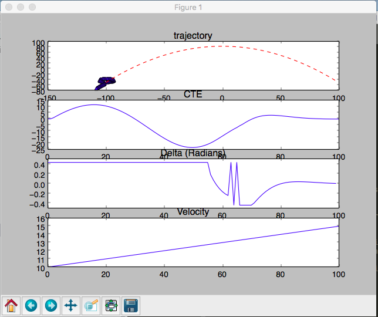

## Reflections on Udacity Term2 MPC Project

### The model

The model I chose is the one taught in the lesson. Here are the state equations:

```
x1 = x0 + v0 * sin(psi0) * dt
y1 = y0 + v0 * cos(psi0) * dt
psi1 = psi0 + v0/ Lf * delta0 * dt
v1 = v0 + a0 * dt
cte1 = cte0 + v0 * sin(espi0) * dt
epsi1 = epsi0 + v0 * delta0 / Lf * dt
```

Numeral 1 represents the state at time t+1 while 0 represents state at time t. x, y represents the location of the vehicle. I have chosen to work in vehicle coordinates, hence x0 and y0 will always be 0. psi is the orientation of the car relative to the x-axis, psi0 also always 0 by choice of coordinate system. dt is the time between t and t+1. cte is the cross-track error and is calculated as such:
```
cte0 = f(x0) - y0
```
where f(x0) is the polynomial fitted to the waypoints, evalulated at x0. espi is the orientation error, the difference between actual orientation and desired orientation. It is calculated as such:
```
epsi0 = psi0 - arctan(f'(x0))
```

where f'(x0) is the derivative of the fitted polynomial, evaluated at x0.

The actuator outputs are a (acceleration) throttle output and delta, which is the steering angle. a ranges from [-1,1] and delta ranges from [-25, 25] in degrees which must be converted to [-1,1] before sending to the simulator. There are 6 state variables and 2 actuator variables.

### Chosen value of N and dt
I have played around with different values of N and dt. Larger values of N (around 40 to 50) increases the time taken to solve, more importantly, it returns trajectories that basically u-turns and tries to stay on the spot instead of moving forward. See the plot I got from running this in the MPC quiz. Basically i guessed the solver was trying to minimize cte which is a valid solution as long as the u-turn is tight. One solution would be to include distance towards a future destinated waypoint as a cost so the solver would be forced to move forward, but this can actually return trajectories that move towards the end goal but totally does not follow the desired trajectory. My solution was to eliminate u-turns, and that means deviations from the desired trajectory should be heavily penalized. epsi perfectly captures this idea. Like this:

```
fg[0] += 100 * CppAD::pow(vars[epsi_start + i], 2);
```



Now the car hugs the center of the lane very closely. Small values of N can lead to situations where the car does not simulate far ahead enough to account for sharp curves and turns. A good value that i settle on is N = 20;

dt is the time interval between actuations. It is also how much the state can change between evaluations. Visually, it controls the spacing between the dots in the green and yellow lines. As dt increases, for the same v, the spacing between dots increases. Smaller dt allows for finer and smoother predicted trajectories that follow curves. Larger dt can lead to sharp and abrupt actuator outputs that destabilizes the system. Smaller dt allows for larger state space to be explored and evaluated in the solver, hence, we can potentially arrive at a lower cost than the larger dt. I settled on a value of dt = 0.05.

Together, N * dt = 2.0s. This is how long the green line stretches out towards the horizon in the simulator, it represents how far ahead the predicted trajectory has predicted, in distance and in time.

### Preprocessing waypoints
I am working in the vehicle coordinates since the coordinates to plot desired and predicted trajectories are in vehicle coordinates. But the ptsy and ptsx given to us are in map coordindates. So I transformed them before fitting polynomial using these points.
```
// Transform x,y from map to vehicle coordinates
// This simplifies a lot of calculations because
// the fitted polynomial will start from 0,
// x, y and psi are all 0
// and the output from ipopt solver will be small
// (in the vehicle coordinates)
for (int i = 0; i < ptsy.size(); ++i) {
    const double curr_x = ptsx[i] - px;
    const double curr_y = ptsy[i] - py;
    ptsx[i] = curr_x * cos(psi) + sin(psi) * curr_y;
    ptsy[i] = -curr_x * sin(psi) + cos(psi) * curr_y;
}
```

The current state of the vehicle will also be in vehicle coordinates, meaning x,y,psi will all be 0.

```
state << 0, 0, 0, v, cte, epsi;
```

### Dealing with latency

The hardest part of this assignment is dealing with latency. I used the current state of the vehicle and simulated it ahead by the delay (100ms) before passing to the solver. This method works well for 100ms, but for 200ms and above, the fitted polynomial will oscillate wildly, driving the car out of control. Note that this is done before we transform ptsx and ptsy to vehicle coordinates, because the transformation equations depend on the updated values of px, py and psi.

```
// simulate ahead to account for latency in actuation
px = px + v * cos(psi) * delay;
py = py + v * sin(psi) * delay;
psi = psi + v * -1 * delta0 / Lf * delay;
v = v + a * delay;
```

### Challenge: Driving as far as I can, safely
I managed to attain a top speed of 98 mph with a max reference velocity of 110 by modifying the cost function. The key is to recognize we can only drive fast safely on straight portions and the curves should be taken at lower speeds. To model that, I made ref_v in the cost function a function of the current and future curvature of the desired trajectory!

```
const double curvature = CppAD::atan(coeffs[1] + 2 * coeffs[2] * i + 3 * coeffs[3] * CppAD::pow(i, 2));
const double new_ref_v = ref_v * (1 - 2 * CppAD::fabs(curvature));
fg[0] += 100 * CppAD::pow(vars[v_start + i] - new_ref_v, 2);
```

It is now possible for the velocity of the car to increase and decrease based on the curvature of the trajectory. From the equation, it is also possible for v to go negative, since curvature ranges from 0 to postive infinity. The car starts going haywire when v is negative (essentially the car is in reverse). To prevent that, we set the lowerbound constraint that v has to be at >= 0.

```
  // velocity cannot be negative
  for (int i = v_start; i < cte_start; ++i) {
    vars_lowerbound[i] = 0;
    vars_upperbound[i] = 1.0e19;
  }
```

Now the car actually applies the brakes when taking sharp turns! :)

### Video

A recording of my simulator run is available at video.mov! If you like my project please favourite my repo! Many thanks! :)
